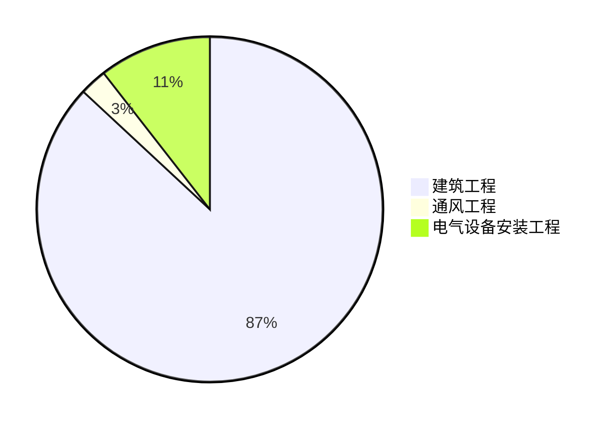
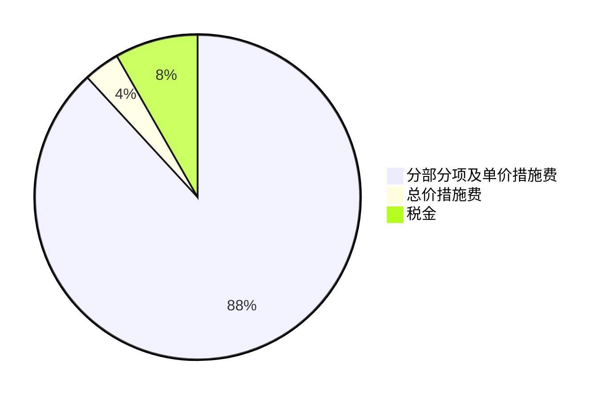

# 长春华翔车顶二层钢平台工程报价分析

## 一、总体报价情况
本次长春华翔车顶二层钢平台工程的投标总价为490,499.99元。各单项工程报价分别为：建筑工程426,439.18元、通风工程12,454.45元、电气设备安装工程51,606.36元。

## 二、各单项工程报价明细

### （一）建筑工程
- **单位工程投标报价汇总**：
    - 分部分项及单价措施费375,989.87元，其中包含拆除工程、混凝土及钢筋混凝土工程、金属结构工程等各细分项目费用。
    - 总价措施费15,238.74元，主要为安全文明施工费。
    - 其他项目暂未涉及相关费用。
    - 税金35,210.57元。
- **分部分项工程和单价措施项目清单与计价**：详细列出了如原地面地坪拆除、建筑垃圾及土石方外运、恢复原有地面等各具体项目的编码、名称、特征描述、工程量及金额等信息。

### （二）通风工程
- **单位工程投标报价汇总**：
    - 分部分项及单价措施费11,178.72元，包含通风工程主体及单价措施费。
    - 总价措施费247.38元（安全文明施工费）。
    - 其他项目无相关费用。
    - 税金1,028.35元。
- **分部分项工程和单价措施项目清单与计价**：涵盖了轴流通风机、碳钢通风管道、柔性接口等各通风相关项目的具体计价信息。

### （三）电气设备安装工程
- **单位工程投标报价汇总**：
    - 分部分项及单价措施费46,611.32元，包括强电系统、弱电桥架及配管等部分。
    - 总价措施费733.96元（安全文明施工费）。
    - 其他项目无相关费用。
    - 税金4,261.08元。
- **分部分项工程和单价措施项目清单与计价**：详细列举了配电箱、电力电缆、配管、配线等各电气设备安装相关项目的计价详情。

## 三、报价数据可视化

### （一）单项工程报价占比饼图

此饼图直观展示了各单项工程报价在总投标报价中的占比情况，可清晰看出建筑工程报价占比最大。

### （二）建筑工程各部分费用占比分层饼图

该分层饼图呈现了建筑工程中各主要费用部分的占比关系，有助于了解各项费用在建筑工程报价中的比重。