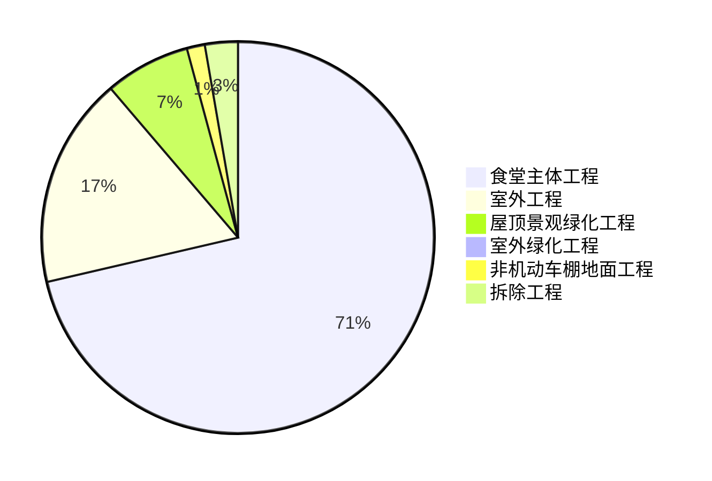

# 食堂施工总承包工程报价分析

## 一、工程概况
本项目为食堂施工总承包工程，包含了土方工程、桩基工程、土建工程、安装工程等多个分项工程，以及室外工程、屋顶景观绿化、室外绿化工程、非机动车棚地面工程等相关附属工程，另外还有拆除工程等前期准备工作。以下是各部分工程的投标报价及相关费用分析。

## 二、各分项工程报价分析

### （一）食堂主体工程
- **土建工程**：
    - **分部分项工程费**：金额较高，达9411378.17元，涵盖了如垫层、基础、梁、柱、板、墙体等众多项目，不同项目根据其工程量、综合单价计算费用，例如矩形柱（含柱帽）根据不同规格和混凝土强度等级分别计价。
    - **措施项目费**：包括施工技术措施项目和施工组织措施项目，总计1392051.64元。施工技术措施项目如模板工程费用较高，与各构件的模板制作、安装、拆除等相关；施工组织措施项目则包含了如安全文明施工基本费等按实际发生项之和计算的费用。
    - **其他项目费**：包含暂列金额、暂估价、计日工、施工总承包服务费等，其中暂列金额按招标文件规定额度列计，暂估价涵盖材料（工程设备）暂估价、专业工程暂估价等。
    - **规费**：按计算基数×费率得出，金额为156257.11元。
    - **增值税**：以计算基数×费率计算，为777086.27元。
- **安装工程**：
    - **分部分项工程费**：通过对各类电气设备、灯具、管线等项目的工程量与综合单价乘积求和得出，总计5794958元。例如配电箱柜、各类灯具、不同规格的电缆电线等都有各自的计价方式。
    - **措施项目费**：包括施工技术措施项目和施工组织措施项目，共计18428.07元。施工技术措施项目涉及配管、配线等工程的相关措施费用；施工组织措施项目包含安全文明施工费等按规定费率计算的费用。
    - **其他项目费**：暂列金额、暂估价等按相关规定列计，具体明细需参照各明细表格。
    - **规费**：金额为44566.84元，依据计算基数×费率计算。
    - **增值税**：计算基数×费率得出，为527215.8元。

### （二）室外工程
- **室外工程-土建工程**：
    - **分部分项工程费**：主要包括室外雨污水工程、室外道路工程等项目的费用，共计552209.27元。如污水HDPE双壁波纹管、钢筋混凝土检查井、雨水口及落水井、钢筋混凝土隔油池、挖土方、回填方、管道垫层等项目根据各自的工程量和综合单价计算费用。
    - **措施项目费**：施工技术措施项目和施工组织措施项目费用合计14237.93元，其中施工技术措施项目如模板工程费用根据具体工程量和综合单价确定，施工组织措施项目包含安全文明施工基本费等按规定计算的费用。
    - **其他项目费**：按相关规定列计暂列金额、暂估价等，具体情况参照各明细表格。
    - **规费**：计算得出为5366.38元。
    - **增值税**：金额是51463.22元。
- **室外工程-安装工程**：
    - **分部分项工程费**：涵盖室外给水工程、电气工程、弱电工程等方面的费用，总计180810.28元。例如钢丝网骨架聚乙烯复合给水管、闸阀、水表、配管、电力电缆、配线等项目分别按各自的计价方式计算费用。
    - **措施项目费**：施工技术措施项目和施工组织措施项目费用共749.74元，施工技术措施项目涉及相关管道、线缆安装的措施费用，施工组织措施项目包含安全文明施工基本费等按规定费率计算的费用。
    - **其他项目费**：暂列金额、暂估价等按相关要求列计，具体参照各明细表格。
    - **规费**：计算得出为1813.17元。
    - **增值税**：金额为16503.59元。

### （三）屋顶景观绿化工程
- **分部分项工程费**：包含硬质景观、绿化工程等方面的费用，共计1135977.68元。例如土工布铺设、白色砾石散置、园路、点风景石、木（防腐木）屋面、砖基础、茶室平台护栏、户外茶室、鱼池过滤布置、楼（地）面卷材防水、栽植乔木、栽植灌木、铺种草皮等项目根据各自的工程量和综合单价计算费用。
- **措施项目费**：施工技术措施项目和施工组织措施项目费用合计2326.5元，施工技术措施项目费用根据具体工程措施情况确定，施工组织措施项目包含安全文明施工基本费等按规定计算的费用。
- **其他项目费**：按相关规定列计暂列金额、暂估价等，具体参照各明细表格。
- **规费**：计算得出为6477.99元。
- **增值税**：金额为103030.4元。

### （四）室外绿化工程
- **分部分项工程费**：包括回（换）填种植土、铺种草皮、栽植花卉、栽植灌木、栽植乔木等项目的费用，总计56560.17元。各项目根据其工程量和综合单价计算具体费用。
- **措施项目费**：施工技术措施项目和施工组织措施项目费用共286.19元，其中施工技术措施项目费用根据具体绿化工程措施情况确定，施工组织措施项目包含安全文明施工基本费等按规定计算的费用。
- **其他项目费**：暂列金额、暂估价等按相关要求列计，具体参照各明细表格。
- **规费**：计算得出为796.89元。
- **增值税**：金额为5187.89元。

### （五）非机动车棚地面工程
- **分部分项工程费**：主要是非机动车棚地面工程费用，金额为237306元，按相关计价方式确定。
- **措施项目费**：未明确给出具体金额及明细，需参照各明细表格进一步了解。
- **其他项目费**：暂列金额、暂估价等按相关规定列计，具体参照各明细表格。
- **规费**：未明确给出具体金额，需参照各明细表格进一步了解。
- **增值税**：金额为21357.54元。

### （六）拆除工程
- **分部分项工程费**：主要是拆除原建筑及相关项目的费用，共计452859.99元，例如拆除原建筑按建筑面积计算费用，一个集装箱的拆除和移动等按项计价。
- **措施项目费**：施工技术措施项目和施工组织措施项目费用合计31680.37元，施工技术措施项目如模板工程、大型机械设备进出场及安拆等费用根据具体情况确定，施工组织措施项目包含安全文明施工基本费等按规定计算的费用。
- **其他项目费**：暂列金额、暂估价等按相关要求列计，具体参照各明细表格。
- **规费**：计算得出为1276.71元。
- **增值税**：金额为43723.54元。

## 三、报价汇总分析
整个食堂施工总承包工程的投标报价汇总如下：
- **总投标报价**：各分项工程及相关费用汇总后，工程总投标报价为19880510元（大写：壹仟玖佰捌拾捌万零伍佰壹拾元整）。

## 四、关键数据图表展示

### （一）各分项工程费用占比饼图

此饼图直观展示了各分项工程费用在总投标报价中的占比情况，可清晰看出食堂主体工程费用占比较大，是整个工程费用的主要部分，而室外绿化工程等占比相对较小。

### （二）各分项工程分部分项工程费与措施项目费对比柱状图

```mermaid
graph TD;
    A["食堂土建工程"] --> B["分部分项工程费(9411378.17元)"];
    A --> C["措施项目费(1392051.64元)"];
    D["食堂安装工程"] --> E["分部分项工程费(5794958元)"];
    D --> F["措施项目费(18428.07元)"];
    G["室外工程-土建工程"] --> H["分部分项工程费(552209.27元)"];
    G --> I["措施项目费(14237.93元)"];
    J["室外工程-安装工程"] --> K["分部分项工程费(180810.28元)"];
    J --> L["措施项目费(749.74元)"];
    M["屋顶景观绿化工程"] --> N["分部分项工程费(1135977.68元)"];
    M --> O["措施项目费(2326.5元)"];
    P["室外绿化工程"] --> Q["分部分项工程费(56560.17元)"];
    P --> R["措施项目费(286.19元)"];
    S["非机动车棚地面工程"] --> T["分部分项工程费(237306元)"];
    S --> U["措施项目费(未明确)"];
    V["拆除工程"] --> W["分部分项工程费(452859.99元)"];
    V --> X["措施项目费(31680.37元)"];
```

该柱状图对比了各分项工程的分部分项工程费与措施项目费，能直观反映出不同分项工程中这两项费用的高低差异，有助于分析各分项工程成本构成的特点。例如食堂土建工程的分部分项工程费远高于措施项目费，而一些小型工程如室外绿化工程，两者费用相对都较低且差距不那么明显。
